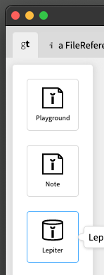

# Apress Source Code

This repository accompanies [*Agile Artificial Intelligence in Pharo*](https://www.apress.com/9781484253830) by Alexandre Bergel (Apress, 2020).

[comment]: #cover


The book provides a complete implementation of a number of complex algorithms. Download the files as a zip using the green button, or clone the repository to your machine using Git.

## How to load it in Pharo? (see below for Glamorous Toolkit)

The provided code was designed for [Pharo](http://pharo.org) and it works Pharo 8 and Pharo 9. Open a playground and execute the instructions:

```Smalltalk
Metacello new
    baseline: 'AgileArtificialIntelligence';
    repository: 'github://Apress/agile-ai-in-pharo/src';
    load.
```

## How to load it in Glamorous Toolkit?

Download GT from [https://gtoolkit.com/](https://gtoolkit.com/) and open it.


In GT open the git component and 'clone' (via the '+') the git repository
[https://github.com/coentjo/agile-ai-in-pharo.git](https://github.com/coentjo/agile-ai-in-pharo.git)

Double click on the repo and then in the next window click 'Load'
on every package:


Open Lepiter



then add new database


if you cloned the git it's in a subdir of the GT-dir:

```
.../pharo-local/iceberg/https:/agile-ai-in-pharo/lepiter
```

and after that click on page 'Workshop AI':


## Content

The repository provides the complete implementation of:

- Neural network library
- Matrix library
- Genetic algorithm
- Zoomorphic creature
- NEAT neuroevolution algorithm
- Mario-like game

Furthermore, all the scripts and code snippets are provided in the `scripts` folder.

## Releases

Release v1.0 corresponds to the code in the published book, without corrections or updates.

## Contributions

See the file [Contributing.md](Contributing.md) for more information on how you can contribute to this repository.
