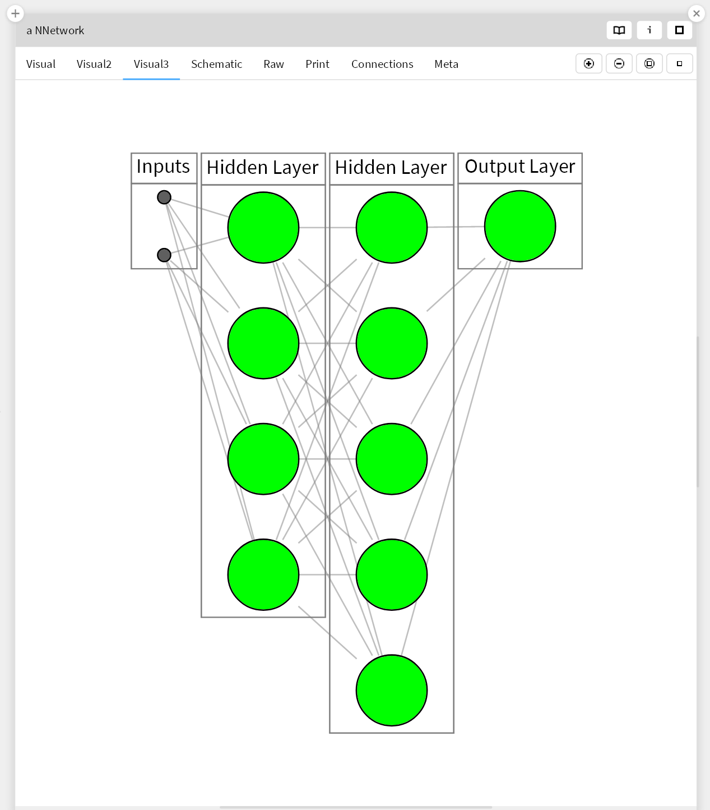

# First a little about this fork 

See below for more info on the original git repo by Alexandre Bergel, accompanying the book mentioned there. 
Alexandre created a number of scripts to visualize the story. He did it in Pharo, this fork is meant to do 'the same' but in 
[Glamorous Toolkit](https://gtoolkit.com/), 
using Live Slides and GtExamples. 

# How to load it in Glamorous Toolkit (GT)?

Download GT from [https://gtoolkit.com/](https://gtoolkit.com/). GT or Glamorous Toolkit is open source, free, and introduces the concept of moldable development! 

In a Playground in GT execute 

```Smalltalk
Metacello new
    baseline: 'AgileArtificialIntelligence';
    repository: 'github://coentjo/agile-ai-in-pharo:master/src';
    onConflictUseIncoming;
    load.
```

and then in GT you can load the Lepiter files by executing:

```Smalltalk
BaselineOfAgileArtificialIntelligence loadLepiter
```


## Some more info

The cloned git is in a subdir of your GToolkit-dir:

```
.../pharo-local/iceberg/https:/agile-ai-in-pharo/lepiter
```

## In 'Lepiter' open page 'Workshop AI':


## Some screenshots





--------------------  

Now follows the README from the original repo follows, with the info about how to use it in Pharo: 

# Apress Source Code

The repository 
[https://github.com/Apress/agile-ai-in-pharo](https://github.com/Apress/agile-ai-in-pharo)
accompanies [*Agile Artificial Intelligence in Pharo*](https://www.apress.com/9781484253830) by Alexandre Bergel (Apress, 2020). 


[comment]: #cover


This fork 
[https://github.com/coentjo/agile-ai-in-pharo](https://github.com/coentjo/agile-ai-in-pharo) is a (start of a) port to use the scripts in GToolkit. 


First there was the book: 
The book provides a complete implementation of a number of complex algorithms. Download the files as a zip using the green button, or clone the repository to your machine using Git.

But if you haven't seen it yet look at this film: 
[https://tube.switch.ch/videos/v6uqRi7Lfm](https://tube.switch.ch/videos/v6uqRi7Lfm)


## How to load it in Pharo? 

The provided code was designed for [Pharo](http://pharo.org) and it works Pharo 8 and Pharo 9. Open a playground and execute the instructions:

## Original git repo (for Pharo):

```Smalltalk
Metacello new
    baseline: 'AgileArtificialIntelligence';
    repository: 'github://Apress/agile-ai-in-pharo/src';
    load.
```


## Content

The repository provides the complete implementation of:

- Neural network library
- Matrix library
- Genetic algorithm
- Zoomorphic creature
- NEAT neuroevolution algorithm
- Mario-like game

Furthermore, all the scripts and code snippets are provided in the `scripts` folder.

## Releases

Release v1.0 corresponds to the code in the published book, without corrections or updates.

## Contributions

See the file [Contributing.md](Contributing.md) for more information on how you can contribute to this repository. 

