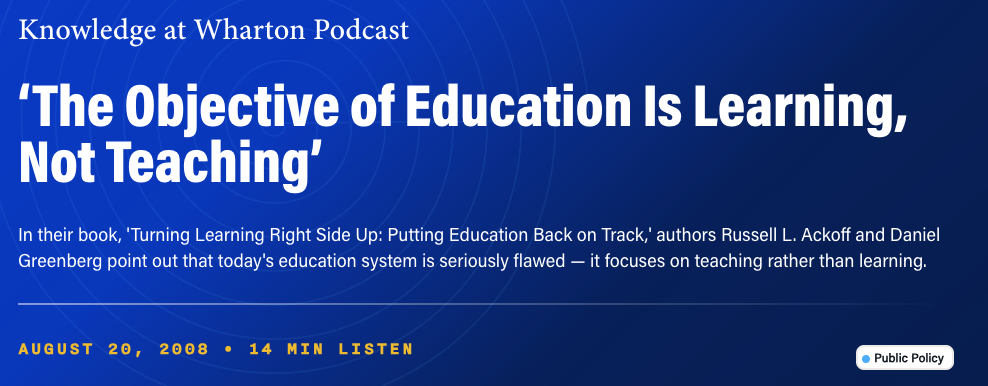

# Learning not Teaching

Wharton professor Lloyd Armstrong argued that **the objective of education is learning, not teaching** — teaching is only a means. That framing matters now that conversational AI can produce teaching-like output on demand: polished explanations, structured documents, even plausible code.

