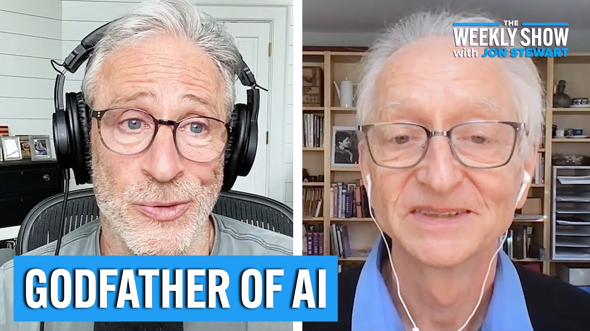

- [Jon Stewart interviews Geoffrey Hinton](https://www.youtube.com/watch?v=jrK3PsD3APk).
- First half hour Geoffrey explains how neural networks work.
- After that they discuss the implications of AI.

{height=8cm}

