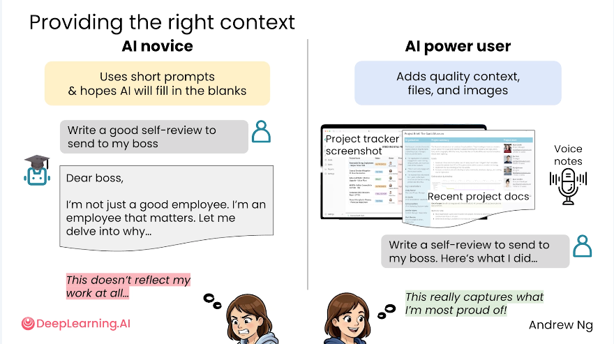

Short course about prompting in 2026

[ai-prompting-for-everyone](https://learn.deeplearning.ai/courses/ai-prompting-for-everyone)

- Asking biased questions gives biased answers. 
- Some AI's can use search engines: When? 
- Watch out for Outdated Sources!
- When to use an AI and when to use a Search Engine. 
- Using Deep Research
- Web Search vs. Deep Research

- [Anthropic/Margot van Laar: The Prompting Playbook](https://www.youtube.com/watch?v=G2B0YWuJUgI)
