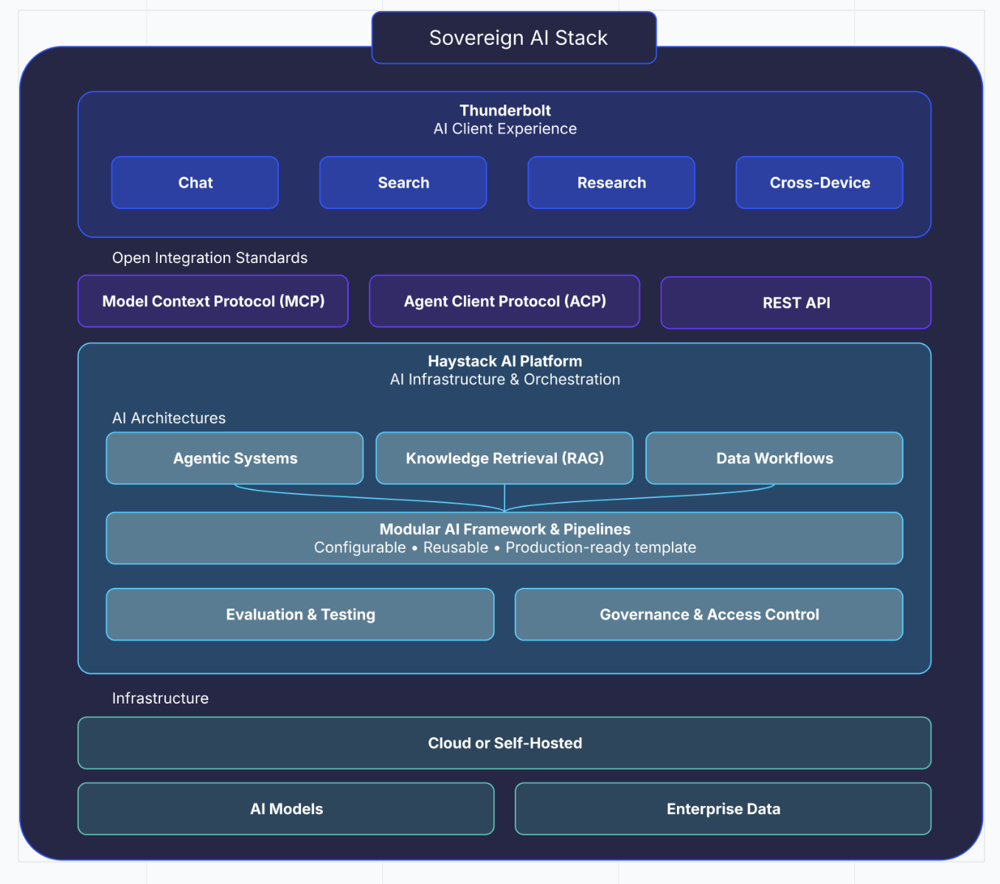

[mozilla-introduces-thunderbolt](https://www.thunderbolt.io/blog/mozilla-introduces-thunderbolt)

Mozilla Introduces Thunderbolt: An Enterprise AI Client Built for Control and Independence (2026-04)

"AI is too important to outsource. With Thunderbolt, we’re giving organizations a sovereign AI client that allows them to decide how AI fits into their workflows — on their infrastructure, with their data, and on their terms." (Ryan Sipes, CEO of MZLA Technologies Corporation)

